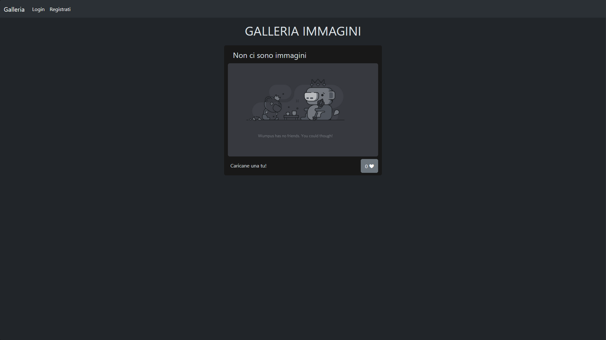
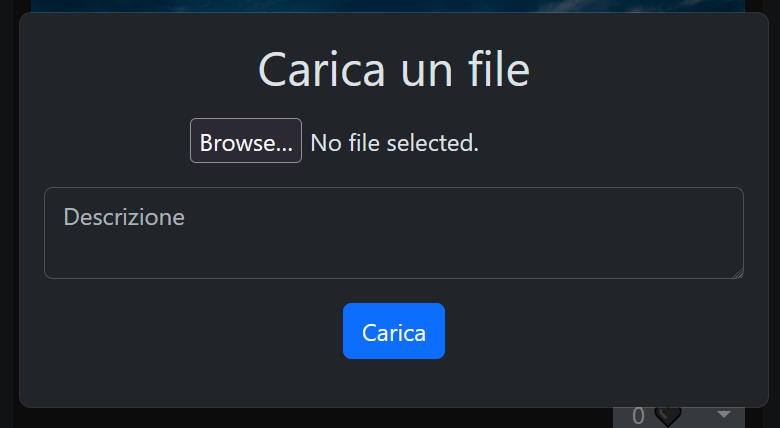
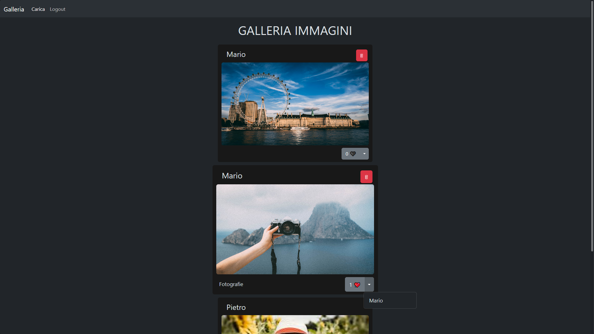
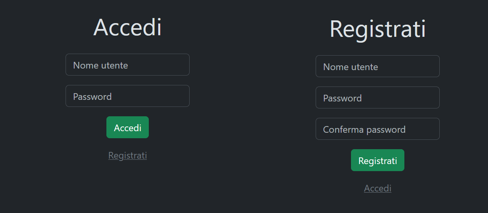
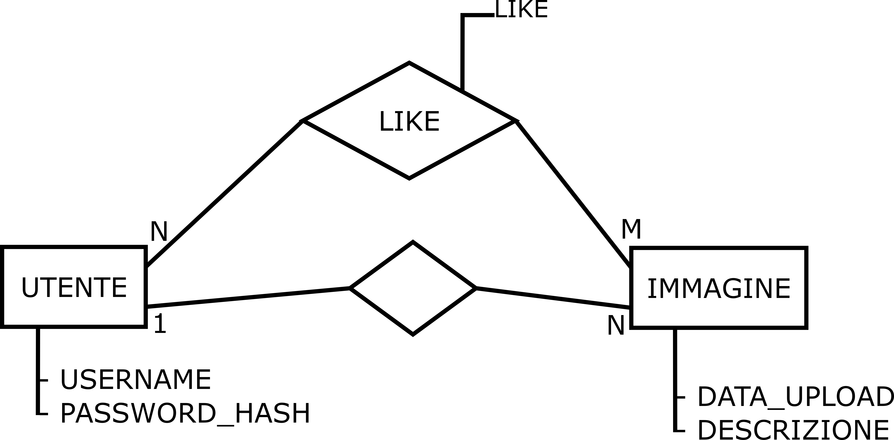

> Anno scolastico 2024-2025
> Bergamasco Jacopo, Classe 5AIA, ITST J.F. Kennedy, Pordenone
# GALLERIA IMMAGINI

Web application scritta in [PHP](https://www.php.net/) che presenta una galleria di immagini caricabili dagli utenti.
L'applicazione è fornita di un sistema di autenticazione per permettere agli utenti di creare dei propri account, con cui si potrà caricare le proprie immagini e interagire con quelle degli altri utenti.
## Pagina principale
- La pagina è formata da una schermata che mostra tutte le immagini caricate nell'app.

- L'utente non loggato può visualizzare tutte le immagini inserite il loro conteggio dei like, ma non può né caricare, né mettere like alle immagini.

- Nella pagina è presente una navbar in cui è possibile recarsi alla schermata di login o di registrazione. L'utente loggato vedrà nella stessa navbar un bottone per eseguire il logout e uno per caricare un'immagine.

- Il form di caricamento dell'immagine compare attraverso una finestra modale dinamica creata col framework Bootstrap5.

- L'utente loggato può caricare immagini, mettere e rimuovere like dalle immagini e rimuovere le immagini caricate da lui

## Pagine di accesso

## Schema concettuale del database

## Installazione
Per hostare il sito è necessario inizializzare il database. Il DBMS utilizzato nell'applicazione è [MySQL](https://www.mysql.com/), tutte le definizioni delle strutture dati sono contenute nel file `init.sql`, eseguendo quel file si inizializzerà il database.